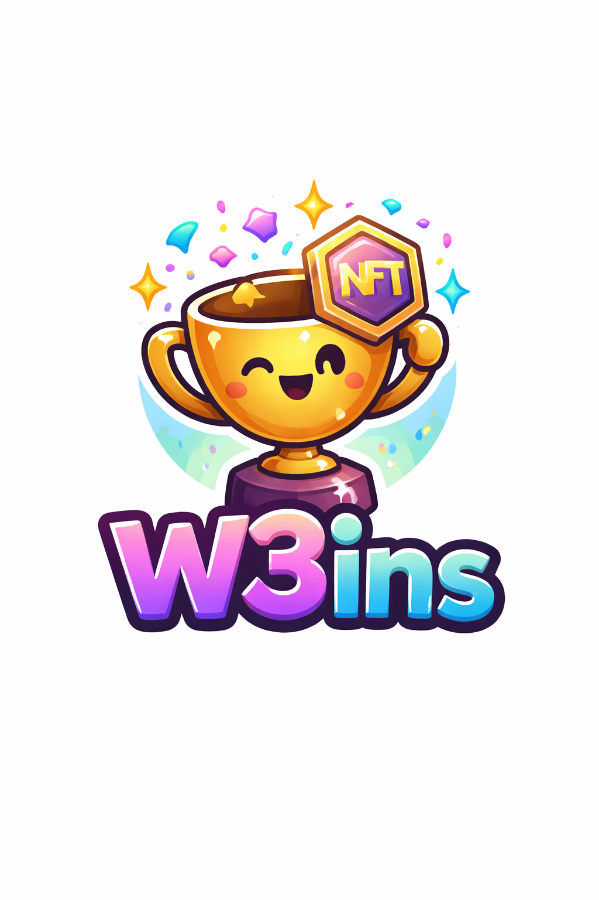

## 👋 Hi there, I'm Sarthak

Backend & Web3 Protocol Engineer specializing in scalable systems, smart contract development, and high-performance applications. Known for building efficient backend architectures and crafting pixel-perfect, production-grade user interfaces.

###

  
  
  
  
  
  
  
  
  
  
  
  
  
  
  
  
  
  
  

 

###

🔗 Blockchain Dev

###

 

<picture>
  <source media="(prefers-color-scheme: dark)" srcset="https://raw.githubusercontent.com/Sarthak-Java1124/Sarthak-Java1124/output/pacman-contribution-graph-dark.svg">
  <source media="(prefers-color-scheme: light)" srcset="https://raw.githubusercontent.com/Sarthak-Java1124/Sarthak-Java1124/output/pacman-contribution-graph.svg">
  
</picture>

---

## My Hackathon Winning Project 🏆

  <table>
    <tr>
      <td>
        <a href="https://github.com/Sarthak-Java1124/crypto-llm" target="_blank">
          

            
            
Crypto LLM AI + Web3

          

        </a>
      </td>
    </tr>
  </table>

---

## Smart Contract Development

  <table>
    <tr>
      <td>
        <a href="https://github.com/Sarthak-Java1124/W3ins" target="_blank">
          

            
            
W3ins Protocol

          

        </a>
      </td>
      <td>
        <a href="https://github.com/Sarthak-Java1124/pledgeFund-Contract" target="_blank">
          

            
            
Pledge Fund DeFi

          

        </a>
      </td>
      <td>
        <a href="https://github.com/Sarthak-Java1124/Anonimity-Contracts" target="_blank">
          

            
            
Anonymity Privacy

          

        </a>
      </td>
      <td>
        <a href="https://github.com/Sarthak-Java1124/nft-minting-contract" target="_blank">
          

            
            
NFT Minting ERC-721

          

        </a>
      </td>
    </tr>
  </table>

---

## Backend Development

  <table>
    <tr>
      <td>
        <a href="https://github.com/Sarthak-Java1124/goLang-powBlockchain" target="_blank">
          

            
            
PoW Blockchain Go

          

        </a>
      </td>
      <td>
        <a href="https://github.com/Sarthak-Java1124/golang-gRPC" target="_blank">
          

            
            
gRPC Microservices

          

        </a>
      </td>
      <td>
        <a href="https://github.com/Sarthak-Java1124/websocket-TypingTest" target="_blank">
          

            
            
Realtime WebSockets

          

        </a>
      </td>
      <td>
        <a href="https://github.com/Sarthak-Java1124/go-SkillLink" target="_blank">
          

            
            
SkillLink API

          

        </a>
      </td>
      <td>
        <a href="https://github.com/Sarthak-Java1124/go-W3insBackend" target="_blank">
          

            
            
W3ins Backend

          

        </a>
      </td>
    </tr>
  </table>

---

## Frontend Development

  <table>
    <tr>
      <td>
        <a href="https://github.com/Sarthak-Java1124/CryptoWave" target="_blank">
          

            
            
CryptoWave Dashboard

          

        </a>
      </td>
      <td>
        <a href="https://github.com/Sarthak-Java1124/GTA-VI" target="_blank">
          

            
            
GTA VI UI Interactive

          

        </a>
      </td>
      <td>
        <a href="https://github.com/Sarthak-Java1124/Pixel-Bonk" target="_blank">
          

            
            
Pixel Bonk UI

          

        </a>
      </td>
      <td>
        <a href="https://github.com/Sarthak-Java1124/cronos-402" target="_blank">
          

            
            
Cronos 402 Web3

          

        </a>
      </td>
      <td>
        <a href="https://github.com/Sarthak-Java1124/webMate-SaaS" target="_blank">
          

            
            
WebMate SaaS

          

        </a>
      </td>
    </tr>
  </table>

---

  

---

Designing and shipping scalable backend systems and production-grade Web3 protocols.